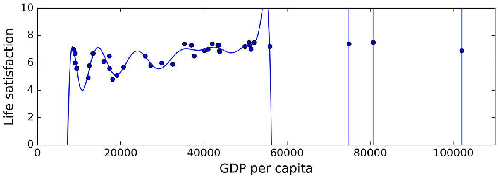

# 第 1 章《概论》习题

## 一、名词解释

- 特征空间
- 假设空间
- 标记空间

## 二、回归与欠拟合/过拟合

如下图是通过 GDP 来对幸福度进行回归，蓝色点为已知样本，蓝色线表示回归曲线，请回答：

（1）该模型是“欠拟合”还是“过拟合”？

（2）分别解释“欠拟合”、“过拟合”的定义，以及模型在欠拟合、或过拟合下对未知样本进行预测，会导致什么结果？

（3）简单说明如何解决过拟合和欠拟合问题。

## 五、KNN 分类模型

KNN 分类模型中，K 是什么意思？简述该模型的工作流程。
