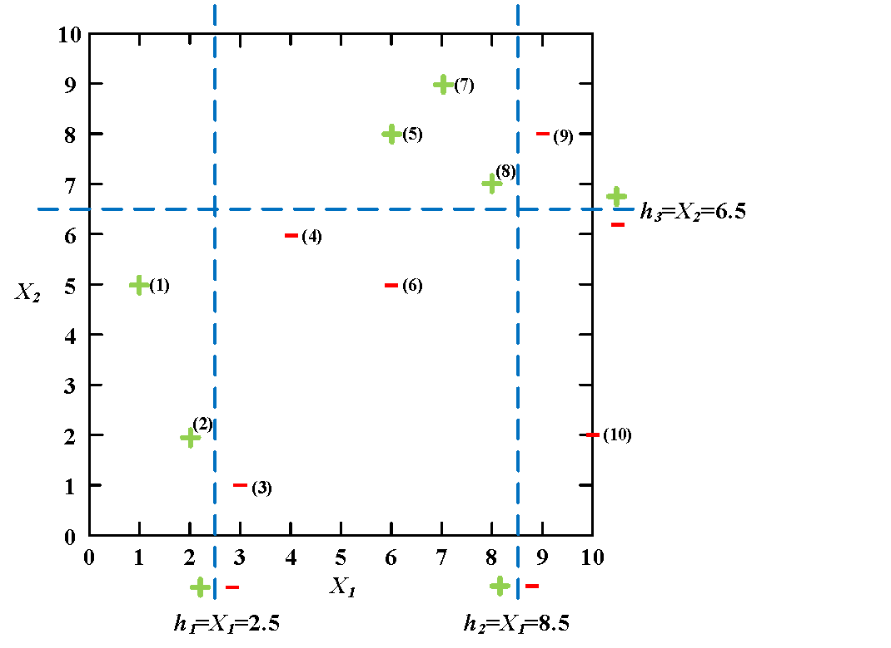

# 第 6 章《集成学习》习题

## 一、名词解释

- 基学习器

## 二、AdaBoost 权重迭代关系

复习 AdaBoost 算法，试推导样本 $x_i$ 第 $t$ 轮的权重与第 $t+1$ 轮权重存在如下迭代关系。其中 $e_t$ 为第 $t$ 轮分类器的错误率：

$$
w_{t+1,i}=\begin{cases}
\dfrac{w_{ti}}{2(1-e_t)}, & \text{分类正确}\\[6pt]
\dfrac{w_{ti}}{2e_t}, & \text{分类不正确}
\end{cases}
$$

## 三、AdaBoost 强分类过程

给定如图表所示的训练样本，弱学习器采用平行于坐标轴的直线 $h_1$、$h_2$ 和 $h_3$，请用 AdaBoost 算法实现强分类过程。

$$
h_1=\begin{cases}1,& X_1<2.5\\-1,& X_1>2.5\end{cases},\quad
h_2=\begin{cases}1,& X_1<8.5\\-1,& X_1>8.5\end{cases},\quad
h_3=\begin{cases}1,& X_2>6.5\\-1,& X_2<6.5\end{cases}
$$

| 样本序号 | 1 | 2 | 3 | 4 | 5 | 6 | 7 | 8 | 9 | 10 |
|---|---|---|---|---|---|---|---|---|---|---|
| 样本点 $X$ | (1,5) | (2,2) | (3,1) | (4,6) | (6,8) | (6,5) | (7,9) | (8,7) | (9,8) | (10,2) |
| 类别 $Y$ | 1 | 1 | -1 | -1 | 1 | -1 | 1 | 1 | -1 | -1 |

