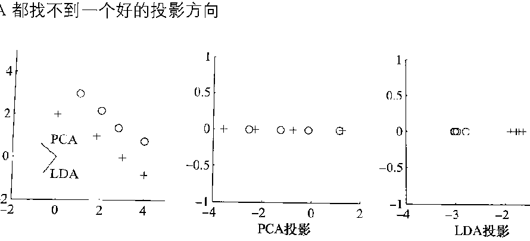

# 第 7 章《维度归约》习题

## 一、名词解释

- 测地线（geodesic）距离

## 四、正交投影矩阵

降维分析中涉及投影的变换矩阵通常要求是正交的。请问：

（1）正交投影矩阵相对于非正交投影矩阵用于降维的优点是什么？

（2）为什么在 PCA 中变换矩阵一定是正交的？

## 五、PCA 与 LDA 投影方向

如图给出了一组数据，使用 LDA 投影比 PCA 投影有更好的投影方向。参照这个图，绘制一个二维数据集示例，让 PCA 和 LDA 找到相同的好方向。另绘制一个数据集，让 PCA 和 LDA 都找不到一个好的投影方向。

## 六、PCA 主分量与方差贡献率

计算题：用 PCA 方法计算这 6 个二维样本数据的一维 PCA 主分量，并计算该主分量的方差贡献率：

$$
\begin{pmatrix}
2 & 3 & 3 & 4 & 5 & 7\\
2 & 4 & 5 & 5 & 6 & 8
\end{pmatrix}
$$

注意：该样本未中心化！
