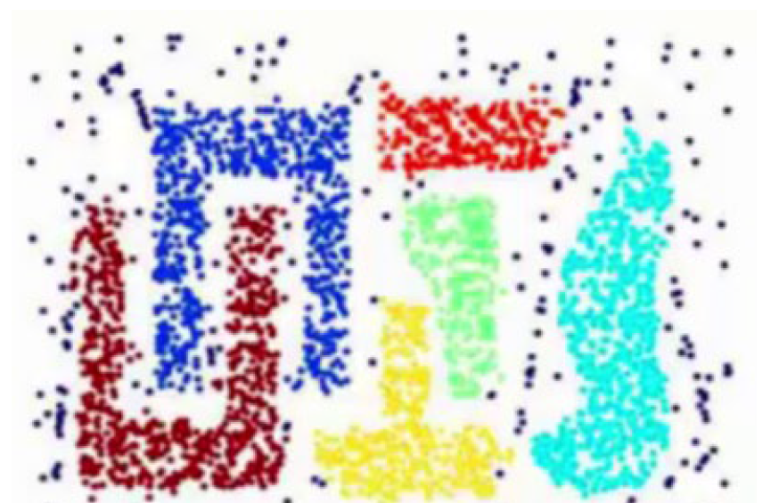

# 第 8 章《聚类》习题

## 一、名词解释

- Jaccard 系数
- 密度可达

## 二、k-means 与 kNN

k-means 算法与 kNN 方法的 $k$ 分别指什么？这两个方法的主要区别是什么？

## 四、k-means 聚类

给定含有 5 个样本的集合：

$$
X=\begin{bmatrix}
0 & 0 & 1 & 5 & 5\\
2 & 0 & 0 & 0 & 2
\end{bmatrix}
$$

试用 k-means 聚类算法将样本聚到两个类中（$k=2$），选 $(0,0)^T$、$(5,2)^T$ 为初始质心。

## 五、聚类算法选择

对于下图的数据分类，宜采用什么类聚类算法？其基本原理是什么？该算法中有哪两个重要参数？这两个参数的取值对聚类的结果有什么影响？

