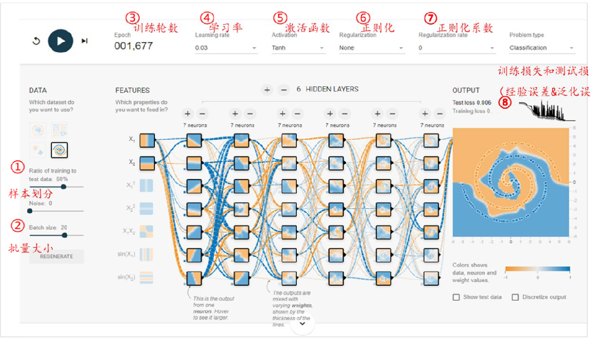
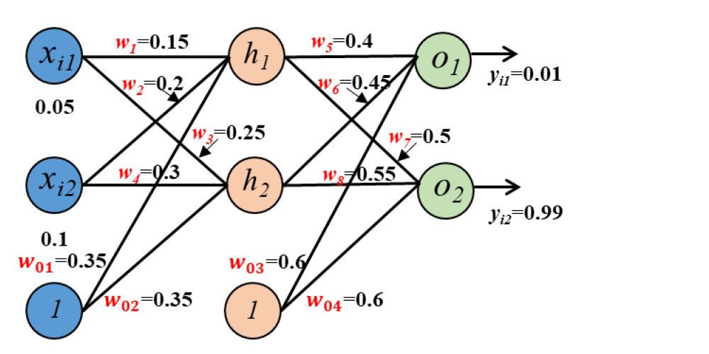

# 第 9 章《神经网络》习题

## 一、TensorFlow 神经网络网页与二分类网络模型

请根据下列 TensorFlow 提供的一个神经网络学习网页，及网页中给出的一个二分类网络模型，回答：

（1）解释①~⑧的名词的含义；

（2）计算该二分类神经网络的参数数量。

## 二、名词解释

- 早停法（Early stopping）
- 暂退法（Dropout）
- 梯度弥散

## 五、BP 神经网络一次迭代

针对下列神经网络，神经元激活函数为 Tanh() 函数，损失函数采用平方误差函数（前带 $1/2$ 系数），学习率 $\eta=0.5$，试做一次迭代：

（1）计算 $h_1$、$h_2$、$o_1$、$o_2$ 的误差信号 $\delta$；

（2）更新参数 $w_4$、$w_8$ 和 $w_{01}$。

## 六、BGD 的 BP 神经网络训练步骤

简述采用批量梯度下降（BGD）的 BP 神经网络的训练步骤。

## 七、Softmax 与交叉熵

对于一个 10 分类神经网络，输出层采用 Softmax 层。样本 $x$ 对应的标记 $y$ 为：

$$[0,0,0,0,0,1,0,0,0,0]^T$$

网络前向传播一次得到的输出为：

$$[0.2,0.1,0,0,0,0.4,0,0.15,0.15,0]^T$$

试计算：

（1）交叉熵损失为多少？

（2）若前一隐层某神经元 $h$ 的输出信号为 $0.128$，$h$ 与输出层 10 个神经元的连接权重向量为

$$W=[0.1,-0.1,0.2,-0.2,0.3,-0.3,0.4,-0.4,0.5,-0.5]^T$$

取学习率 $\eta=0.1$，请更新该权重向量。
