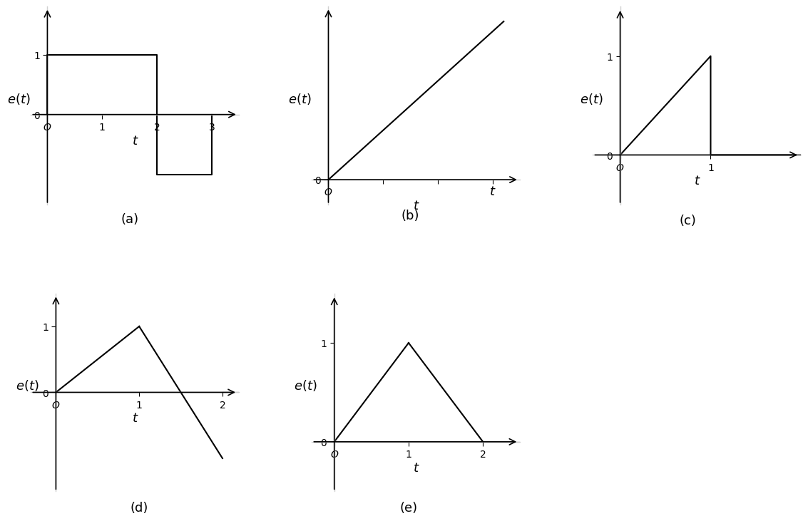

# 笔记

## LTI连续系统的描述

输入输出方程的一般形式

$y(t)$：响应函数，即输出函数

$f(t)$：激励函数，即输入函数

$a_0 -a_{n-1}$, $a_n=1$, $b_0 -b_m$：常数系数

## 经典解法——通解

### 求解齐次方程

$$\dfrac{d^n y}{dt^n} + a_{n-1}\dfrac{d^{n-1}y}{dt^{n-1}} + \ldots + a_1\dfrac{dy}{dt} + a_0 y = 0$$

**特征方程：** $p^n + a_{n-1}p^{n-1} + \ldots + a_1 p + a_0 = 0$

**特征根：** $p_1, p_2, \ldots$

通解构造规则

| 根的类型                              | 通解中的对应项                                               |
| ------------------------------------- | ------------------------------------------------------------ |
| 每一单实根 $p_i$                      | $C e^{p_i t}$ （系数待定）                                   |
| 每一 $k$ 重实根 $p_i$                 | $e^{p_i t}(C_1 + C_2 t + \ldots + C_k t^{k-1})$              |
| 每一对复根 $\alpha \pm j\beta$        | $e^{\alpha t}(C_1 \cos\beta t + D_1 \sin\beta t)$            |
| 每一对 $k$ 重复根 $\alpha \pm j\beta$ | $e^{\alpha t}\left[(C_1 + C_2 t + \ldots C_k t^{k-1})\cos\beta t + (D_1 + D_2 t + \ldots D_k t^{k-1})\sin\beta t\right]$ |

## 经典解法——特解

### 与激励形式有关

$$\dfrac{d^n y}{dt^n} + a_{n-1}\dfrac{d^{n-1}y}{dt^{n-1}} + \ldots + a_1\dfrac{dy}{dt} + a_0 y = f(t)$$

若 $f(t)$ 形如 $e^{\alpha t}P(t)$，$\alpha$ 为常数，$P(t)$ 为多项式。

- 若 $\alpha$ **不是**特征根，特解形式为：$Q(t)e^{\alpha t}$
- 若 $\alpha$ 是特征**单根**，特解形式为：$tQ(t)e^{\alpha t}$
- 若 $\alpha$ 是 **$k$ 重**特征根，特解形式为：$t^k Q(t)e^{\alpha t}$

$Q(t)$ 为与 $P(t)$ 同次的多项式，系数待定。

| 激励函数 $f(t)$                                            | 响应函数 $y(t)$ 的特解                                       |
| :--------------------------------------------------------- | :----------------------------------------------------------- |
| $E$                                                        | $B$                                                          |
| $t^p$                                                      | $B_1 t^p + B_2 t^{p-1} + \cdots + B_p t + B_{p+1}$           |
| $e^{at}$                                                   | $Bt^k e^{at}$（当 $a$ 是 $k$ 重特征根时）                    |
| $\cos(\omega t)$ 或 $\sin(\omega t)$                       | $B_1 \cos(\omega t) + B_2 \sin(\omega t)$                    |
| $e^{at}\cos(\omega t)$  $e^{at}\sin(\omega t)$         | $e^{at}\left[B_1 \cos(\omega t) + B_2 \sin(\omega t)\right]$（当 $a+jb$ 不是特征根） $te^{at}\left[B_1 \cos(\omega t) + B_2 \sin(\omega t)\right]$（当 $a+jb$ 是特征根） |
| $t^p e^{at}\cos(\omega t)$   $t^p e^{at}\sin(\omega t)$ | $\left(B_1 t^p + B_2 t^{p-1} + \cdots + B_p t + B_{p+1}\right)e^{at}\cos(\omega t) + \left(D_1 t^p + D_2 t^{p-1} + \cdots + D_p t + D_{p+1}\right)e^{at}\sin(\omega t)$ |

## 利用算子方程求解零输入响应

- 零输入响应：系统没有外加激励的情况下，由系统初始储能形成的系统输出响应，$y_{zi}(t)$。

- 即求解齐次算子方程
  $$D(p)\,y(t) = 0$$

  解法参考微分方程求通解

  1. 令 $D(p)=0$，求特征根 $p_1, p_2, \ldots, p_r$
  2. 单实根 $p_i$ 对应 $C_i e^{p_i t}$
  3. $k$ 重实根 $p_j$ 对应 $\left(b_0 + b_1 t + \ldots + b_{k-1} t^{k-1}\right) e^{p_j t}$
  4. 根据初始条件确定待定系数。

- 特征方程
  $$D(p) = 0$$

### 转移算子对应的冲激响应

1. 单根
    $$
    H_i(p) = \frac{C_i}{p - p_i}
    $$
    $$
    h_i(t) = C_i e^{p_i t} U(t)
    $$
2. $k$重根
    $$
    H_j(p) = \frac{C_{jk}}{(p - p_j)^k}
    $$
    $$
    h_j(t) = \frac{C_{jk}}{(k-1)!} t^{k-1} e^{p_j t} U(t)
    $$
3. 常数项
    当 $n = m$ 时，$H(p)$ 可化为常数项和真分式之和。
    $$
    H_l(p) = b_m
    $$
    $$
    h_l(t) = b_m \delta(t)
    $$
4. 多项式项
    当 $n < m$ 时，$H(p)$ 可化为多项式和真分式之和。
    $$
    H_k(p) = k_1 + k_2 p + \dots
    $$
    $$
    h_k(t) = k_1 \delta(t) + k_2 \delta'(t) + \dots
    $$

## 总结

引入微分算子后如何由系统方程求

- 转移算子
    $$
    H(p) = \frac{N(p)}{D(p)}
    $$
- 零输入响应
    $$
    D(p) \, y_{zi}(t) = 0
    $$
- 冲激响应
    $$
    h(t) = H(p) \, \delta(t) \quad h(t) \leftrightarrow H(p)
    $$
- 阶跃响应
- 零状态响应
    $$
    y_{zs}(t) = f(t) * h(t)
    $$

# 作业

## 例题1

> 描述某系统的微分方程如下，已知 $y(0^-)=2$，$y'(0^-)=0$，$f(t)=U(t)$。求该系统的零输入响应和零状态响应。
> $$y''(t) + 3y'(t) + 2y(t) = 2f'(t) + 6f(t)$$

(1) 零输入响应

$$y_{zi}''(t) + 3y_{zi}'(t) + 2y_{zi}(t) = 0$$

特征根为 $p_1 = -1$，$p_2 = -2$

$$y_{zi}(t) = C_1 e^{-t} + C_2 e^{-2t} \Rightarrow C_1 + 2C_2 = 0$$

$$y_{zi}(0^+) = y_{zi}(0^-) = y(0^-) = 2 \Rightarrow C_1 + C_2 = 2$$

$$\Rightarrow \begin{cases} C_1 = 4 \\ C_2 = -2 \end{cases}$$

$$y_{zi}(t) = 4e^{-t} - 2e^{-2t} \quad t > 0$$

(2) 零状态响应

$$y''(t) + 3y'(t) + 2y(t) = 2\delta(t) + 6U(t)$$

$$y_{zs}(0^-) = y_{zs}'(0^-) = 0$$

由于 $y_{zs}(t)$ 连续，$y_{zs}(0^+) = y_{zs}(0^-) = 0$。

由于等式右端含有 $\delta(t)$，故 $y_{zs}''(t)$ 含有 $\delta(t)$，所以 $y_{zs}'(t)$ 跃变，即 $y_{zs}'(0^+) \neq y_{zs}'(0^-)$。

等式两端 $0^-$ 到 $0^+$ 积分：
$$y_{zs}'(0^+) - y_{zs}'(0^-) = 2 \Rightarrow y_{zs}'(0^+) = 2$$

当 $t > 0$ 时：
$$y''(t) + 3y'(t) + 2y(t) = 6$$

齐次解：$C_1 e^{-t} + C_2 e^{-2t}$　　特解：$3$

$$y_{zs}(t) = C_1 e^{-t} + C_2 e^{-2t} + 3$$

由初始条件：
$$\begin{cases} y_{zs}(0^+) = 0 \\ y_{zs}'(0^+) = 2 \end{cases} \Rightarrow \begin{cases} C_1 = -4 \\ C_2 = 1 \end{cases}$$

$$y_{zs}(t) = -4e^{-t} + e^{-2t} + 3 \quad t \geq 0$$

## 2.4

> 已知系统的转移算子及未加激励时的初始条件分别为
> (1) $H(p)=\dfrac{p+3}{p^2+3p+2}$, $r(0)=1$, $r'(0)=2$;
> (2) $H(p)=\dfrac{p+3}{p^2+2p+2}$, $r(0)=1$, $r'(0)=2$;
> (3) $H(p)=\dfrac{p+3}{p^2+2p+1}$, $r(0)=1$, $r'(0)=2$。
> 求各系统的零输入响应并指出各自的自然频率。

(1) $H(p)=\dfrac{p+3}{p^2+3p+2}$, $r(0)=1$, $r'(0)=2$

系统的特征多项式为 $p^2+3p+2$

系统的特征方程为 $p^2+3p+2=0$

因为 $p^2+3p+2=(p+1)(p+2)$

所以特征根 $\lambda_1=-1$, $\lambda_2=-2$

系统的零输入响应为

$$r(t)=c_1 e^{-t}+c_2 e^{-2t}$$

将 $r(0)=1$, $r'(0)=2$ 代入 $r(t)$、$r'(t)$，确定 $c_1$、$c_2$ 如下：

$$\begin{cases} r(0)=c_1+c_2=1 \\ r'(0)=-c_1-2c_2=2 \end{cases} \Rightarrow \begin{cases} c_1=4 \\ c_2=-3 \end{cases}$$

所以系统的零输入响应

$$r_{zi}(t)=(4e^{-t}-3e^{-2t}), \quad t>0$$

自然频率为：$-1$, $-2$。

---

(2) $H(p)=\dfrac{p+3}{p^2+2p+2}$, $r(0)=1$, $r'(0)=2$

系统的特征多项式为 $p^2+2p+2$

系统的特征方程为 $p^2+2p+2=0$

因为 $p^2+2p+2=(p+1)^2+1$

所以特征根共轭复根 $\lambda_1=-1+j$, $\lambda_2=-1-j$

系统的零输入响应为

$$r(t)=e^{-t}(c_1 \cos t+c_2 \sin t)$$

将 $r(0)=1$, $r'(0)=2$ 代入 $r(t)$、$r'(t)$，确定 $c_1$、$c_2$ 如下：

$$\begin{cases} r(0)=c_1=1 \\ r'(0)=-c_1+c_2=2 \end{cases} \Rightarrow \begin{cases} c_1=1 \\ c_2=3 \end{cases}$$

所以系统的零输入响应为

$$r_{zi}(t)=e^{-t}(\cos t+3\sin t), \quad t>0$$

系统的自然频率为：$-1+j$, $-1-j$。

---

(3) $H(p)=\dfrac{p+3}{p^2+2p+1}$, $r(0)=1$, $r'(0)=2$

系统的特征多项式为 $p^2+2p+1$

系统的特征方程为 $p^2+2p+1=0$

因为 $p^2+2p+1=(p+1)^2$ 所以特征根为二重根 $\lambda_1=\lambda_2=-1$。

所以系统的零输入响应为

$$r(t)=c_1 e^{-t}+c_2 t e^{-t}$$

将 $r(0)=1$, $r'(0)=2$ 代入 $r(t)$、$r'(t)$，确定 $c_1$、$c_2$ 如下：

$$\begin{cases} r(0)=c_1=1 \\ r'(0)=-c_1+c_2=2 \end{cases} \Rightarrow \begin{cases} c_1=1 \\ c_2=3 \end{cases}$$

所以系统的零输入响应为

$$r_{zi}(t)=e^{-t}(1+3t), \quad t>0$$

系统为自然频率为 $-1$。

## 2.5

> 已知系统的微分方程与未加激励时的初始条件分别如下：
> $$
> \frac{\mathrm{d}^3}{\mathrm{d}t^3}r(t)+2\frac{\mathrm{d}^2}{\mathrm{d}t^2}r(t)+\frac{\mathrm{d}}{\mathrm{d}t}r(t)=3\frac{\mathrm{d}}{\mathrm{d}t}e(t)+e(t)
> $$
>
> $$
> r(0)=r^\prime(0)=0,\quad r^{\prime\prime}(0)=1
> $$
>
> 求其零输人响应，并指出自然频率。

系统的特征多项式
$$
p\left(p^2+2p+1\right)=0
$$
所以系统的自然频率为
$$
\lambda_1=0, \lambda_2=\lambda_3=-1
$$
系统的零输入响应为
$$
r(t)=c_1+c_2e^{-t}+c_3te^{-t}
$$
将初始条件代入，解得
$$
\begin{cases}
c_1=1 \\
c_2 = -1 \\
c_3 = -1
\end{cases}
$$
所以系统的零输人响应为
$$
r_{zi}(t)=1-e^{-t}(1+t), t>0
$$
自然频率为0，一1。

## 2.7

> 利用冲激系数的取样性求下列积分值。
>
> 1. $$
>    \int_{-\infty}^{\infty}\delta(t-2)\sin t\mathrm{d}t
>    $$
>
> 2. $$
>    \int_{-\infty}^{\infty}\delta(t+3)e^{-t}\mathrm{d}t
>    $$

1. $$
   \begin{aligned}
   & \int_{-\infty}^{\infty}\delta(t-2)\sin t\mathrm{d}t \\
   = & \sin 2 \int_{-\infty}^{\infty}\delta(t-2)\mathrm{d}t \\
   = & \sin 2
   \end{aligned}
   $$

2. $$
   \begin{aligned}
   & \int_{-\infty}^{\infty}\delta(t+3)e^{-t}\mathrm{d}t \\
   = & e^3 \int_{-\infty}^{\infty}\delta(t+3)\mathrm{d}t \\
   = & e^3
   \end{aligned}
   $$

## 2.8

> 求取下列微分方程所描述的系统的冲激响应。
>
> (1) $\displaystyle \frac{\mathrm{d}}{\mathrm{d}t}r(t)+2r(t)=e(t)$
>
> (2) $\displaystyle 2\frac{\mathrm{d}}{\mathrm{d}t}r(t)+8r(t)=e(t)$
>
> (3) $\displaystyle \frac{\mathrm{d}^{3}}{\mathrm{d}t^{3}}r(t)+\frac{\mathrm{d}^{2}}{\mathrm{d}t^{2}}r(t)+2\frac{\mathrm{d}}{\mathrm{d}t}r(t)+2r(t)=\frac{\mathrm{d}^{2}}{\mathrm{d}t^{2}}e(t)+2e(t)$
>
> (4) $\displaystyle \frac{\mathrm{d}}{\mathrm{d}t}r(t)+3r(t)=2\frac{\mathrm{d}}{\mathrm{d}t}e(t)$
>
> (5) $\displaystyle \frac{\mathrm{d}^{2}}{\mathrm{d}t^{2}}r(t)+3\frac{\mathrm{d}}{\mathrm{d}t}r(t)+2r(t)=\frac{\mathrm{d}^{3}}{\mathrm{d}t^{3}}e(t)+4\frac{\mathrm{d}^{2}}{\mathrm{d}t^{2}}e(t)-5e(t)$

(1)

算子方程为

$$(p+2)r(t)=e(t)\quad\Longrightarrow\quad (p+2)h(t)=\delta(t)$$

所以

$$h(t)=H(p)\delta(t)=\dfrac{1}{p+2}\delta(t)=\mathrm{e}^{-2t}\varepsilon(t)$$

(2)

算子方程为

$$(2p+8)r(t)=e(t)$$

所以

$$H(p)=\dfrac{1}{2p+8}$$

$$h(t)=H(p)\delta(t)=\dfrac{1}{2p+8}\delta(t)=\dfrac{1}{2}\cdot\dfrac{1}{p+4}\delta(t)=\dfrac{1}{2}\mathrm{e}^{-4t}\varepsilon(t)$$

(3)

算子方程为

$$(p^{3}+p^{2}+2p+2)r(t)=(p^{2}+2)e(t)$$

所以

$$H(p)=\dfrac{p^{2}+2}{p^{3}+p^{2}+2p+2}$$

$$h(t)=H(p)\delta(t)=\dfrac{p^{2}+2}{p^{3}+p^{2}+2p+2}\delta(t)=\dfrac{1}{p+1}\delta(t)=\mathrm{e}^{-t}\varepsilon(t)$$

(4)

算子方程为

$$(p+3)r(t)=2p e(t)$$

所以

$$H(p)=\dfrac{2p}{p+3}$$

$$h(t)=H(p)\delta(t)=\dfrac{2p}{p+3}\delta(t)=\left(2-\dfrac{6}{p+3}\right)\delta(t)=2\delta(t)-6\mathrm{e}^{-3t}\varepsilon(t)$$

(5)

算子方程为

$$(p^{2}+3p+2)r(t)=(p^{3}+4p^{2}-5)e(t)$$

所以

$$H(p)=\dfrac{p^{3}+4p^{2}-5}{p^{2}+3p+2}$$

$$h(t)=H(p)\delta(t)=\dfrac{p^{3}+4p^{2}-5}{p^{2}+3p+2}\delta(t)$$

对有理分式进行分解（分母 $p^{2}+3p+2=(p+1)(p+2)$）：

$$\dfrac{p^{3}+4p^{2}-5}{p^{2}+3p+2}=p+1+\dfrac{-2}{p+1}+\dfrac{-3}{p+2}$$

于是

$$h(t)=\left(p+1+\dfrac{-2}{p+1}+\dfrac{-3}{p+2}\right)\delta(t)=\delta'(t)+\delta(t)-\bigl(2\mathrm{e}^{-t}+3\mathrm{e}^{-2t}\bigr)\varepsilon(t)$$

## 2.21

>  已知某线性系统单位阶跃响应为$r_{\varepsilon}(t)=(2e^{-2t}-1)\varepsilon(t)$，试利用卷积的性质求下列波形信号激励下的零状态响应。
>
> 

(a)

由图(a)可得

$$e(t) = \varepsilon(t) - 2\varepsilon(t-2) + \varepsilon(t-3)$$

所以
$$
\begin{aligned}
r_{zs} &= h(t) * e(t) = \frac{dr_\varepsilon(t)}{dt} * e(t) \\
&= r_\varepsilon(t) * \frac{d}{dt}e(t) \\
&= (2e^{-2t} - 1)\varepsilon(t) * \frac{d}{dt}\big[\varepsilon(t) - 2\varepsilon(t-2) + \varepsilon(t-3)\big] \\
&= (2e^{-2t} - 1)\varepsilon(t) * \big[\delta(t) - 2\delta(t-2) + \delta(t-3)\big] \\
&= (2e^{-2t} - 1)\varepsilon(t) - 2\big[2e^{-2(t-2)} - 1\big]\varepsilon(t-2) + \big[2e^{-2(t-3)} - 1\big]\varepsilon(t-3)
\end{aligned}
$$

## 2.23

> 如图所示电路，其输人电压为单个倒锯齿波，求零状态响应电压$u_L(t)$。
>
> 