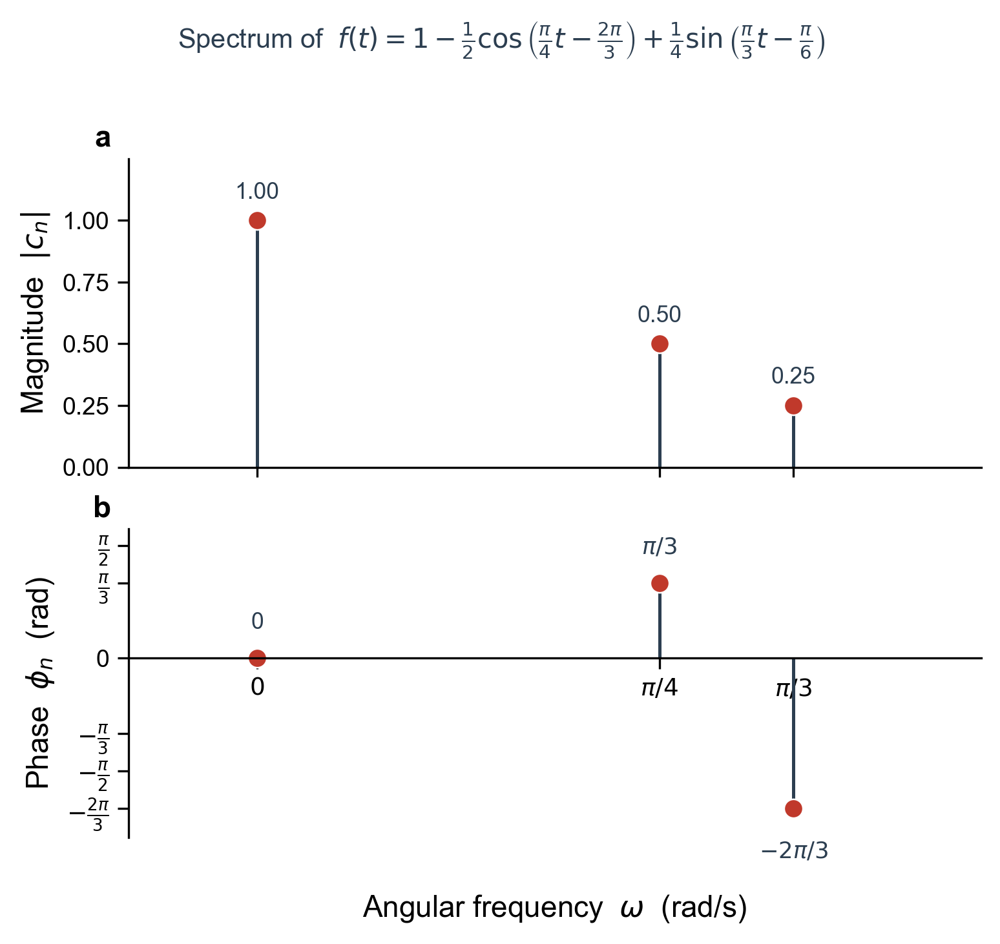
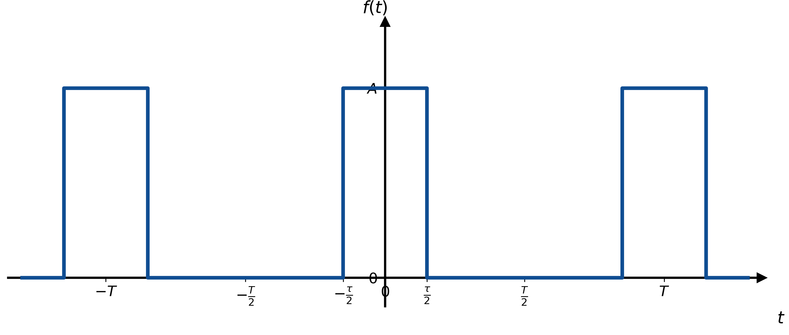
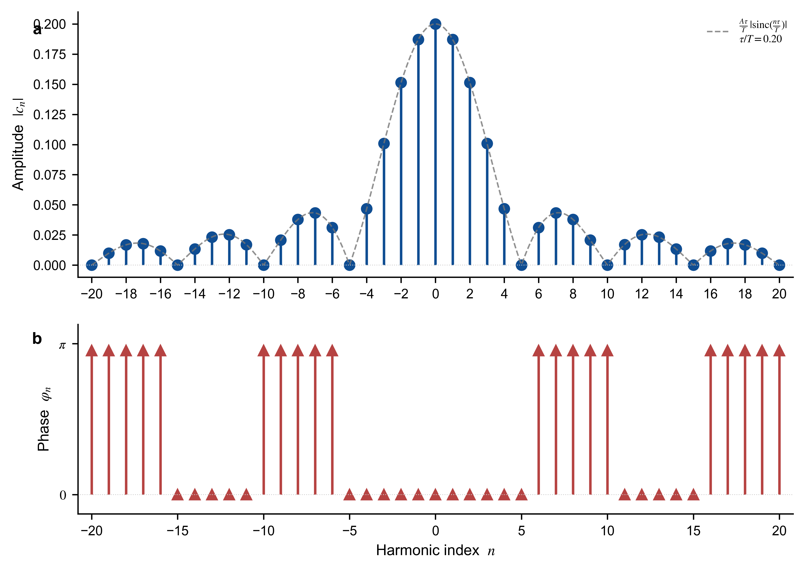
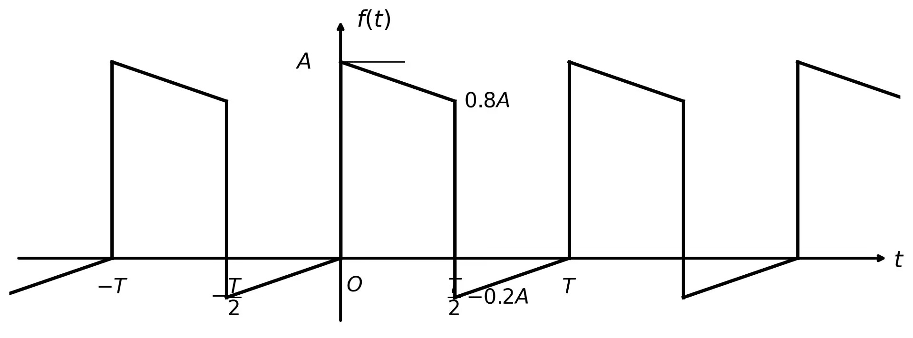
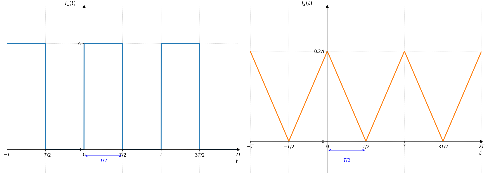

# 笔记

## 三角 Fourier 级数

当满足Dirichlet条件时，周期为$T$的周期信号$f(t)$可以在区间$ (t₁, t₁+T)$内表示为三角Fourier级数：

$$
\begin{aligned}
f(t) =& \frac{a_0}{2} + a_1 \cos \Omega t + a_2 \cos 2\Omega t + \cdots + a_n \cos n\Omega t + \cdots \\
&+ b_1 \sin \Omega t + b_2 \sin 2\Omega t + \cdots + b_n \sin n\Omega t + \cdots \\
=& \frac{a_0}{2} + \sum_{n=1}^{\infty} \left( a_n \cos n\Omega t + b_n \sin n\Omega t \right)
\end{aligned}
$$

其中 $\Omega = \dfrac{2\pi}{T}$ 为基波频率。

- $\dfrac{a_0}{2}$：直流分量
- $a_1 \cos \Omega t + b_1 \sin \Omega t$：基波分量
- $a_n \cos n\Omega t + b_n \sin n\Omega t \ (n>1)$：n次谐波分量

各分量系数

$$
a_0 = \frac{2}{T} \int_{t_1}^{t_1+T} f(t)\,dt
$$

$$
a_n = \frac{2}{T} \int_{t_1}^{t_1+T} f(t) \cos n\Omega t\,dt
$$

$$
b_n = \frac{2}{T} \int_{t_1}^{t_1+T} f(t) \sin n\Omega t\,dt
$$

$$
n = 1,2,3,\cdots
$$

通常取积分限为$(0,T)$或$(-T/2,T/2)$

直流分量
$$
\overline{f(t)} = \frac{1}{T} \int_{t_1}^{t_1+T} f(t)\,dt = \frac{a_0}{2}
$$

### 误差函数

实际应用中，只能取有限项来进行分析。

有限项Fourier级数：

$$
S_N(t) = \frac{a_0}{2} + \sum_{n=1}^{N} \left( a_n \cos n\Omega t + b_n \sin n\Omega t \right)
$$

误差函数：

$$
\varepsilon_N(t) = f(t) - S_N(t)
$$

均方误差（常用于判定系统性能指标，MSE）：

$$
E_N = \overline{\varepsilon_N^2(t)} = \frac{1}{T} \int_{t_1}^{t_1+T} \varepsilon_N^2(t) \,\mathrm{d}t
$$

$a_0, a_n, b_n$给出最小均方误差意义上的最佳近似。

$$
= \overline{f^2(t)} - \left[ a_0^2 + \frac{1}{2} \sum_{n=1}^{N} \left( a_n^2 + b_n^2 \right) \right]
$$

### 合并同频率项

两种常用表达式：三角型和余弦型

$$
\begin{aligned}
f(t) &= \frac{A_0}{2} + \sum_{n=1}^{\infty} A_n \cos\left( n\Omega t + \varphi_n \right), \quad t \in \left( t_1, t_1 + T \right) \\
&= \frac{a_0}{2} + \sum_{n=1}^{\infty} \left( a_n \cos n\Omega t + b_n \sin n\Omega t \right)
\end{aligned}
$$

$$
A_0 = a_0
$$

偶函数
$$
A_n = \sqrt{a_n^2 + b_n^2}
$$

奇函数
$$
\varphi_n = -\operatorname{arctg}\frac{b_n}{a_n}
$$

偶函数
$$
a_n = A_n \cos\varphi_n
$$

奇函数
$$
b_n = -A_n \sin\varphi_n
$$

在一定时间间隔内，任意一个代表信号的函数$f(t)$可以用一个直流分量和一系列谐波分量之和来表示。

## 频谱图

$A_n \sim nΩ$幅度频谱图（通常说频谱指幅度频谱），其中$A_0$为2倍直流分量。

$\varphi_n \sim nΩ$相位频谱图。

周期信号的频谱只出现在$nΩ$等离散频率点，是离散谱。

## 指数Fourier级数

周期为$T$的周期信号$f(t)$可以在区间$ (t₁, t₁+T)$内用指数Fourier级数表示为：

$$
f(t) = \sum_{n=-\infty}^{\infty} c_n \mathrm{e}^{jn\Omega t}
$$

基波频率
$$
\Omega = \frac{2\pi}{T}
$$

$$
c_n = \frac{1}{T} \int_{t_1}^{t_1+T} f(t) \mathrm{e}^{-jn\Omega t} \,\mathrm{d}t
$$

# 例题

## 例题1

> 求周期信号的周期$T$，基波频率$\Omega$，并画出频谱图。
> $$
> f(t)=1-\dfrac{1}{2}\cos\left(\dfrac{\pi}{4}t-\dfrac{2\pi}{3}\right)+\dfrac{1}{4}\sin\left(\dfrac{\pi}{3}t-\dfrac{\pi}{6}\right)
> $$
> 

$T_1=8,\quad T_2=6$

周期$T=\operatorname{lcm}(8, 6)=24$，基波频率$Ω=\dfrac{2π}{T}= \dfrac{π}{12}$
$$
\begin{aligned}
f(t) &= \frac{A_0}{2} + \sum_{n=1}^{\infty} A_n \cos\left(n\Omega t + \phi_n\right) \\
&= \frac{2}{2} + \frac{1}{2}\cos\left(3\frac{\pi}{12}t + \frac{\pi}{3}\right) + \frac{1}{4}\cos\left(4\frac{\pi}{12}t - \frac{2\pi}{3}\right) \\
&=\frac{2}{2} + \frac{1}{2}\cos\left(3\frac{\pi}{12}t + \frac{\pi}{3}\right) + \frac{1}{4}\cos\left(4\frac{\pi}{12}t - \frac{2\pi}{3}\right)
\end{aligned}
$$

基波频率
$$
\Omega=\dfrac{\pi}{12}
$$
绘制频谱图：

先看常数项$1$，这是直流分量，也就是频率为 $0$ 的分量。因此在 $\omega=0$ 处有一根谱线，幅度为$1$。

直流项没有振荡，所以相位一般写成 $0$，或者说相位无实际意义。

再看第一项

$$
\frac12\cos\left(3\Omega t+\frac{\pi}{3}\right)
$$

这一项对应：

$$
k=3
$$

$$
\omega=3\Omega=3\cdot \frac{\pi}{12}=\frac{\pi}{4}
$$

幅度为$\dfrac12$，相位为$\dfrac{\pi}{3}$

所以在 $\omega=\dfrac{\pi}{4}$ 处，幅度谱画高度为 $\dfrac12$ 的谱线；相位谱画相位为 $\dfrac{\pi}{3}$ 的谱线。

再看第二项：

$$
\frac14\cos\left(4\Omega t-\frac{2\pi}{3}\right)
$$

于是这一项对应：

$$
k=4
$$

$$
\omega=4\Omega=4\cdot \frac{\pi}{12}=\frac{\pi}{3}
$$

幅度为$\dfrac14$，相位为$-\dfrac{2\pi}{3}$

## 例题2

> 周期脉冲函数的频谱
>
> 周期为 $T$ 的矩形脉冲信号 $f(t)$，脉冲幅度为 $A$，脉冲宽度为 $\tau(=-\dfrac{T}{5})$：
> $$
> f(t) = 
> \begin{cases} 
> A, & -\dfrac{\tau}{2}<t<\dfrac{\tau}{2} \\[8pt]
> 0, & -\dfrac{T}{2}<t<-\dfrac{\tau}{2} \quad \& \quad \dfrac{\tau}{2}<t<\dfrac{T}{2}
> \end{cases}
> $$
> 

指数形式傅里叶级数

$$
f(t) = \frac{1}{2} \sum_{n=-\infty}^{+\infty} \dot{A}_n \, e^{jn\Omega t}
$$

其中$\Omega = \dfrac{2\pi}{T}$为基波角频率。

傅里叶系数计算

$$
\begin{aligned}
\dot{A}_n &= \frac{2}{T} \int_{-\dfrac{T}{2}}^{\dfrac{T}{2}} f(t) \, e^{-jn\Omega t} \, dt \\
&= \frac{2}{T} \int_{-\dfrac{\tau}{2}}^{\dfrac{\tau}{2}} A \, e^{-jn\Omega t} \, dt
\end{aligned}
$$

当$n=0$时，
$$
A_0 = \frac{2A\tau}{T}
$$
当$n\neq 0$时，
$$
A_n=\frac{2A}{T}\left[\frac{e^{-jn\Omega t}}{-jn\Omega}\right]_{-\tau/2}^{\tau/2}
$$
代入上下限：
$$
A_n=\frac{2A}{T}\cdot \frac{e^{-\dfrac{jn\Omega \tau}2}-e^{\dfrac{jn\Omega \tau}2}}{-jn\Omega}
$$
利用公式
$$
e^{-jx}-e^{jx}=-2j\sin x
$$
得到
$$
A_n=\frac{2A}{T}\cdot \frac{2\sin(n\Omega\tau/2)}{n\Omega}
$$
即
$$
A_n=\frac{2A\tau}{T}\operatorname{Sa}\left(n\pi\frac{\tau}{T}\right)
$$

因此频谱是在$\omega=n\Omega=n\dfrac{2\pi}{T}$处的一系列离散谱线，谱线高度由
$$
|\dfrac{A_n}2|=\left|
\frac{A\tau}{T}
\operatorname{Sa}
\left(n\pi\frac{\tau}{T}\right)
\right|
$$
决定。

| $\omega$      | $\|\dfrac{A_n}2\|$                                           |
| :------------ | :----------------------------------------------------------- |
| $0$           | $\dfrac{A\tau}{T}$                                           |
| $\pm\Omega$   | $\left\|\dfrac{A\tau}{T}\operatorname{Sa}\left(\pi\frac{\tau}{T}\right)\right\|$ |
| $\pm 2\Omega$ | $\left\|\dfrac{A\tau}{T}\operatorname{Sa}\left(2\pi\frac{\tau}{T}\right)\right\|$ |
| $\pm 3\Omega$ | $\left\|\dfrac{A\tau}{T}\operatorname{Sa}\left(3\pi\frac{\tau}{T}\right)\right\|$ |
| $\vdots$      | $\vdots$                                                     |

$$
\varphi_n=\operatorname{arg}\left(\frac{A_n}{2}\right)
$$

对于这个以 $t=0$ 为中心的周期矩形脉冲，因为它是偶函数，所以复傅里叶系数 $\dfrac{A_n}{2}$ 是**实数**：

故
$$
\varphi_n=
\begin{cases}
0, &A_n>0 \\
\pi, &A_n<0
\end{cases}
$$

## 3.6

> 利用周期性矩形脉冲与周期性三角脉冲的傅里叶级数展开式，求如图波形所示信号的傅里叶级数。
>
> 

$f(t)$可看作是一个周期性矩形脉冲$f_1(t)$和一个周期性三角脉冲$f_2(t)$之差（如图所示）

对于矩形脉冲 $f_1(t)$，在一个周期内可以取区间$-\dfrac{T}{2}<t<\dfrac{T}{2}$

此时

$$
f_1(t)=
\begin{cases}
0, & -\dfrac{T}{2}<t<0 \\
A, & 0<t<\dfrac{T}{2}
\end{cases}
$$

它的傅里叶级数写成

$$
f_1(t)=\frac{a_0}{2}+\sum_{n=1}^{\infty}\left(a_n\cos n\Omega t+b_n\sin n\Omega t\right)
$$

先算直流分量：

$$
\frac{a_0}{2}
=\frac{1}{T}\int_{-T/2}^{T/2} f_1(t) \mathrm{d}t
=\frac{1}{T}\int_0^{T/2}A \mathrm{d}t
=\frac{A}{2}
$$

再算余弦系数：

$$
a_n=\frac{2}{T}\int_{-T/2}^{T/2}f_1(t)\cos n\Omega t\mathrm{d}t
$$

因为$f_1(t)$ 在$t<0$为$0$，所以只剩

$$
a_n=\frac{2}{T}\int_0^{T/2}A\cos n\Omega t\mathrm{d}t
$$

$$
a_n=
\frac{2A}{T}
\left[\frac{\sin n\Omega t}{n\Omega}\right]_0^{T/2}
$$

代入$\displaystyle n\Omega\frac{T}{2}=n\pi$，则

$$
n\Omega\frac{T}{2}=n\pi
$$

所以

$$
a_n=\frac{2A}{T}\cdot\frac{\sin n\pi}{n\Omega}=0
$$

因此矩形脉冲没有余弦项。

再算正弦系数：

$$
b_n=\frac{2}{T}\int_0^{T/2}A\sin n\Omega t\mathrm{d}t
$$

$$
b_n=
\frac{2A}{T}
\left[-\frac{\cos n\Omega t}{n\Omega}\right]_0^{T/2}
$$

$$
b_n=
\frac{2A}{T}\cdot\frac{1-\cos n\pi}{n\Omega}
$$

由于

$$
\cos n\pi=(-1)^n
$$

所以

$$
b_n=\frac{A}{n\pi}\bigl[1-(-1)^n\bigr]
$$

当 $n$ 为偶数时，$1-(-1)^n=0$，所以

$$
b_n=0
$$

当 $n$ 为奇数时，$1-(-1)^n=2$，所以

$$
b_n=\frac{2A}{n\pi}
$$

因此只保留奇次谐波：

$$
f_1(t)=\frac{A}{2}
+\frac{2A}{\pi}\sum_{k=0}^{\infty}
\frac{1}{2k+1}\sin(2k+1)\Omega t
$$

再看三角脉冲 $f_2(t)$。它的峰值是 $0.2A$，周期为$T$，并且关于 $t=0$ 是偶函数。

在区间$-\frac{T}{2}<t<\frac{T}{2}$内，它可以写成

$$
f_2(t)=\frac{0.4A}{T}|t|
$$

因为在 $t=0$ 时为 $0$，在 $t=\pm T/2$ 时为

$$
\frac{0.4A}{T}\cdot\frac{T}{2}=0.2A
$$

这和图中的三角波一致。

由于$f_2(t)$是偶函数，所以傅里叶级数中只有余弦项，没有正弦项：

$$
b_n=0
$$

先算直流分量。一个周期内三角形面积为

$$
\frac{1}{2}\cdot T\cdot 0.2A=0.1AT
$$

所以平均值为

$$
\frac{a_0}{2}
=\frac{0.1AT}{T}
=0.1A
=\frac{A}{10}
$$

接着算余弦系数：

$$
a_n=\frac{2}{T}\int_{-T/2}^{T/2}f_2(t)\cos n\Omega t\mathrm{d}t
$$

由于 $f_2(t)$ 是偶函数，$\cos n\Omega t$ 也是偶函数，所以

$$
a_n=\frac{4}{T}\int_0^{T/2}
\frac{0.4A}{T}t\cos n\Omega t\,dt
$$

即

$$
a_n=\frac{1.6A}{T^2}\int_0^{T/2}t\cos n\Omega t\,dt
$$

计算积分：

$$
\int t\cos n\Omega t\,dt
=\frac{t\sin n\Omega t}{n\Omega}
+\frac{\cos n\Omega t}{(n\Omega)^2}
$$

所以

$$
\int_0^{T/2}t\cos n\Omega t\,dt
=\left[
\frac{t\sin n\Omega t}{n\Omega}
+\frac{\cos n\Omega t}{(n\Omega)^2}
\right]_0^{T/2}
$$

代入上限：

$$
\sin n\Omega\frac{T}{2}=\sin n\pi=0
$$

$$
\cos n\Omega\frac{T}{2}=\cos n\pi=(-1)^n
$$

因此

$$
\int_0^{T/2}t\cos n\Omega t\,dt
=\frac{(-1)^n-1}{(n\Omega)^2}
$$

于是

$$
a_n=\frac{1.6A}{T^2}\cdot\frac{(-1)^n-1}{(n\Omega)^2}
$$

又因为

$$
\Omega=\frac{2\pi}{T}
$$

所以

$$(n\Omega)^2=\frac{4n^2\pi^2}{T^2}$$

代入得

$$
a_n=
\frac{1.6A}{T^2}\cdot\frac{T^2}{4n^2\pi^2}\bigl[(-1)^n-1\bigr]
$$

$$
a_n=\frac{0.4A}{n^2\pi^2}\bigl[(-1)^n-1\bigr]
$$

当 $n$ 为偶数时：

$$
(-1)^n-1=0
$$

所以偶次余弦项为 $0$。

当 $n$ 为奇数时：

$$
(-1)^n-1=-2
$$

所以

$$
a_n=-\frac{0.8A}{n^2\pi^2}
$$

因此三角脉冲的傅里叶级数为

$$
f_2(t)
=\frac{A}{10}
-\frac{0.8A}{\pi^2}\sum_{k=0}^{\infty}
\frac{1}{(2k+1)^2}\cos(2k+1)\Omega t
$$

回到原信号$f(t)=f_1(t)-f_2(t)$

代入两个傅里叶级数：

$$
f_1(t)=
\frac{A}{2}
+\frac{2A}{\pi}\sum_{k=0}^{\infty}
\frac{1}{2k+1}\sin(2k+1)\Omega t
$$

$$
f_2(t)=
\frac{A}{10}
-\frac{0.8A}{\pi^2}\sum_{k=0}^{\infty}
\frac{1}{(2k+1)^2}\cos(2k+1)\Omega t
$$

所以

$$
f(t)=
\left[
\frac{A}{2}
+\frac{2A}{\pi}\sum_{k=0}^{\infty}
\frac{1}{2k+1}\sin(2k+1)\Omega t
\right]
-
\left[
\frac{A}{10}
-\frac{0.8A}{\pi^2}\sum_{k=0}^{\infty}
\frac{1}{(2k+1)^2}\cos(2k+1)\Omega t
\right]
$$

因此最终答案为

$$
f(t)=0.4A
+\frac{2A}{\pi}\sum_{k=0}^{\infty}
\frac{1}{2k+1}\sin(2k+1)\Omega t
+\frac{0.8A}{\pi^2}\sum_{k=0}^{\infty}
\frac{1}{(2k+1)^2}\cos(2k+1)\Omega t
$$
