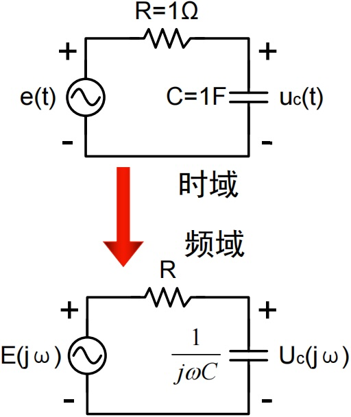
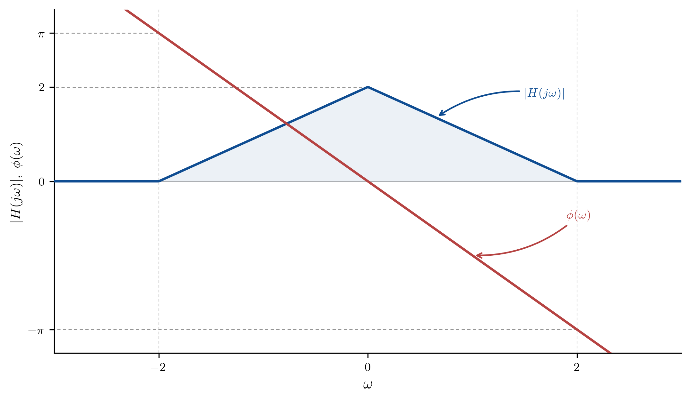

# 笔记

## LTI系统的频域分析法

### LTI系统时域和频域分析法特点

时域分析法

- 以时间为变量。

  求解时域中的线性常系数微分方程。

  信号分解为冲激函数，利用冲激响应和卷积积分求得系统的零状态响应。

- 频域分析法

  以频率为变量。

  求解频域中的代数方程。

  信号分解为正弦函数或指数函数，利用Fourier变换将时域问题转换到频域以简化运算。

  缺点：增加两次积分运算

共同处：利用线性系统的叠加性和齐次性

### 系统函数的定义

输入激励
$$
e(t) \leftrightarrow E(j\omega)
$$
零状态响应
$$
r(t) \leftrightarrow R(j\omega)
$$

$$
r(t)=e(t) * h(t) \leftrightarrow R(j\omega)=E(j\omega)H(j\omega)
$$

系统函数或频率响应函数：联系频域中零状态响应与输入激励的函数。
$$
H(j\omega)=\dfrac{R(j\omega)}{E(j\omega)}
$$

$$
h(t) \leftrightarrow H(j\omega)
$$

系统函数和单位冲激响应为Fourier变换对

### 系统函数的求解

对微分方程两边求Fourier变换
时域微分方程：
$$
\frac{\mathrm{d}^n r}{\mathrm{d}t^n} + a_{n-1}\frac{\mathrm{d}^{n-1} r}{\mathrm{d}t^{n-1}} + \dots + a_1\frac{\mathrm{d} r}{\mathrm{d}t} + a_0 r
= b_m\frac{\mathrm{d}^m e}{\mathrm{d}t^m} + b_{m-1}\frac{\mathrm{d}^{m-1} e}{\mathrm{d}t^{m-1}} + \dots + b_1\frac{\mathrm{d} e}{\mathrm{d}t} + b_0 e
$$

Fourier变换微分性质：
$$
f(t) \leftrightarrow F(j\omega)
$$

$$
\frac{\mathrm{d}f(t)}{\mathrm{d}t} \leftrightarrow j\omega F(j\omega)
$$

对方程作Fourier变换：
$$
\left\{ (j\omega)^n + a_{n-1}(j\omega)^{n-1} + \dots + a_1(j\omega) + a_0 \right\} R(j\omega)
= \left\{ b_m(j\omega)^m + b_{m-1}(j\omega)^{m-1} + \dots + b_1(j\omega) + b_0 \right\} E(j\omega)
$$

定义系统函数：
$$
H(j\omega) = \frac{R(j\omega)}{E(j\omega)}
= \frac{b_m(j\omega)^m + b_{m-1}(j\omega)^{m-1} + \dots + b_1(j\omega) + b_0}{(j\omega)^n + a_{n-1}(j\omega)^{n-1} + \dots + a_1(j\omega) + a_0}
$$

### 频域分析法步骤

1. 时域→频域，得到频域的输入激励信号。
$$
  e(t) \to E(j\omega)
$$

2. 根据系统方程，找出系统函数$H(j\omega)$。可以得到单位冲激响应
$$
  H(j\omega) \leftrightarrow h(t)
$$

3. 在频域中求零状态响应。
$$
  R(j\omega) = E(j\omega)H(j\omega)
$$

4. 频域→时域，得到时域的输出信号。
$$
  R(j\omega) \to r(t)
$$

时域到频域 → 频域求解代数方程 → 频域到时域

## 无失真传输

### 信号失真的原因

- 系统对组成信号的各个频率分量的幅度衰减程度不同，造成信号各频率分量的相对比例关系发生变化，称为幅度失真。
- 系统对组成信号的各个频率分量的相移不与频率成正比，造成信号各频率分量在时间轴上的相对位置关系发生变化，称为相位失真。
- 幅度失真和相位失真都没有产生新的频率分量，属于线性失真。

### 无失真传输

无失真传输指信号经过传输系统之后，只有幅度大小和出现的时间的不同，信号的形状完全不变。

无失真传输的理想条件：
$$
H(j\omega)=|H(j\omega)|\mathrm{e}^{j\phi(\omega)}=K\mathrm{e}^{-j\omega t_0}
$$

$$
h(t)=K\delta(t-t_0)
$$

相位变化与频率变化成比例

# 例题

### 例题1

> 已知系统微分方程和输入激励信号，求响应。
> $$
> \frac{\mathrm{d}}{\mathrm{d}t}r(t)+2r(t)=e(t) \quad e(t)=e^{-t}\varepsilon(t)
> $$

$$
e(t) \leftrightarrow E(j\omega)=\frac{1}{j\omega+1}
$$

由
$$
\mathscr{F}\left[\frac{\mathrm{d}}{\mathrm{d}t}r(t)\right]=j\omega\cdot R(j\omega)
$$
于是
$$
(j\omega+2)R(j\omega)=E(j\omega)
$$

$$
H(j\omega)=\frac{R(j\omega)}{E(j\omega)}=\frac{1}{j\omega+2}
$$

所以
$$
R(j\omega)=H(j\omega)\cdot E(j\omega)=\frac{1}{j\omega+2} \cdot \frac{1}{j\omega+1} = \frac{1}{j\omega+1} - \frac{1}{j\omega+2}
$$

时域的零状态响应：

$$
r(t)=\left[e^{-t}-e^{-2t}\right]\varepsilon(t)
$$

### 例题2

> 电路如图所示，求单位冲激响应$u_C(t)$。
>
> 

根据频域电路欧姆定律，电容电压的频域表达式：
$$
U_C(j\omega) = I\cdot Z_C = I\frac{1}{j\omega C}
$$
根据KVL
$$
E(j\omega)=U_C(j\omega)+U_R(j\omega)=I\left(R+\frac{1}{j\omega C}\right)
$$
于是
$$
H(j\omega)=\frac{U_C(j\omega)}{E(j\omega)}=\frac{\dfrac{1}{j\omega C}}{\dfrac{1}{j\omega C}+R}
$$
带入数值
$$
H(j\omega)=\frac{1}{j\omega + 1} \leftrightarrow h(t)=e^{-t}\varepsilon(t)
$$

### 例题3

> 已知线性系统频响特性和输入激励，求解系统零状态响应。
>
> 输入激励信号：
> $$
> e(t)=2+4 \cos t+4 \cos 2 t
> $$
> 
> 

对输入信号做时域到频域变换，求解$E(j\omega)$

$$
\begin{aligned}
E(j \omega) =&4 \pi \delta(\omega)+4 \pi[\delta(\omega+1)+\delta(\omega-1)] \\
& +4 \pi[\delta(\omega+2)+\delta(\omega-2)]
\end{aligned}
$$

系统频率响应$H(j\omega)$

$$
H(j \omega)=
\begin{cases}
(2-|\omega|) e^{-j \frac{\pi}{2} \omega} & |\omega|<2 \\
0 & |\omega| \geq 2
\end{cases}
$$

> 冲激筛选：对任意连续函数$f(\omega)$，有
>
> $$
> f(\omega)\cdot \delta(\omega-\omega_0) = f(\omega_0)\cdot \delta(\omega-\omega_0)
> $$

频域求解输出信号频谱$R(j\omega)$：

由LTI系统频域关系 $R(j\omega) = E(j\omega)H(j\omega)$，代入计算：
$$
\begin{aligned}
R(j \omega) & =E(j \omega) H(j \omega) \\
& =8 \pi \delta(\omega)+4 \pi \delta(\omega+1) e^{j \frac{\pi}{2}}+4 \pi \delta(\omega-1) e^{-j \frac{\pi}{2}}
\end{aligned}
$$

频域到时域逆变换：
$$
r(t)=4+4 \cos \left(t-\frac{\pi}{2}\right)=4+4 \sin t
$$
