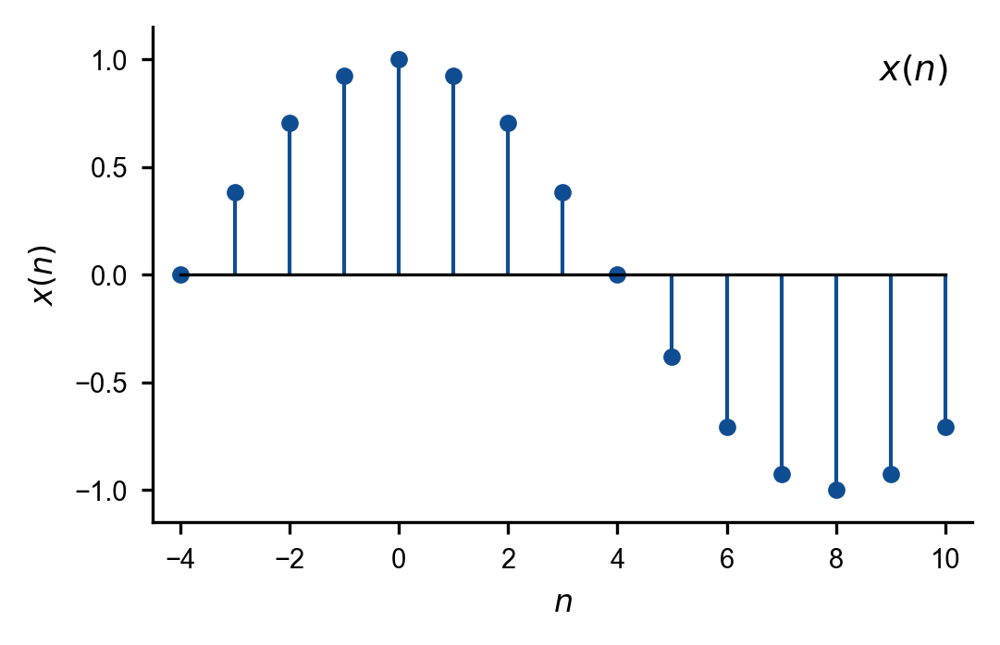
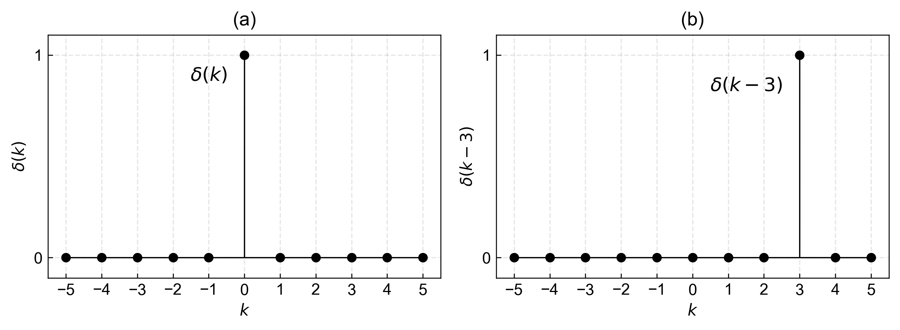
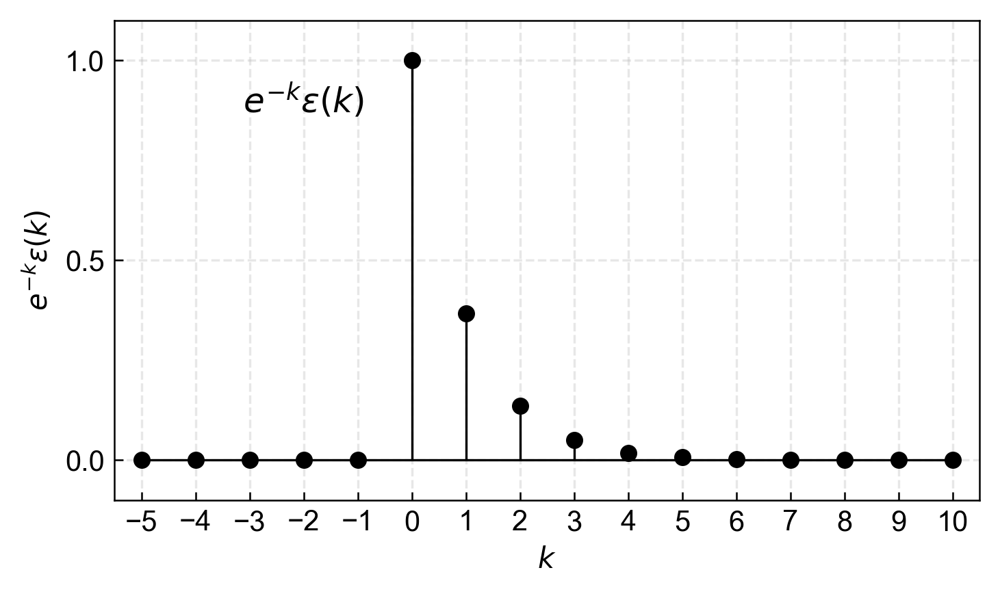
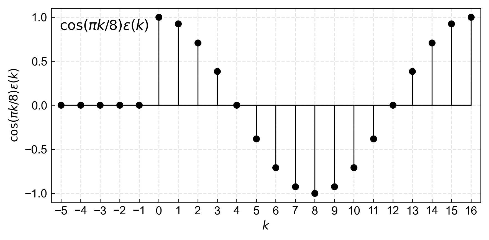
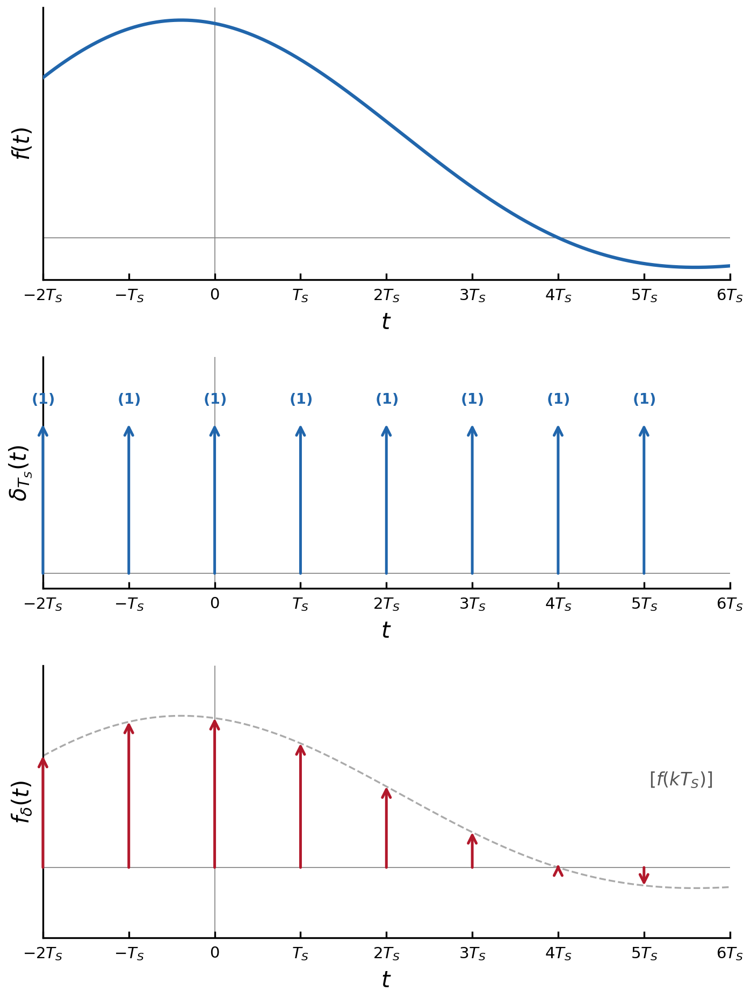
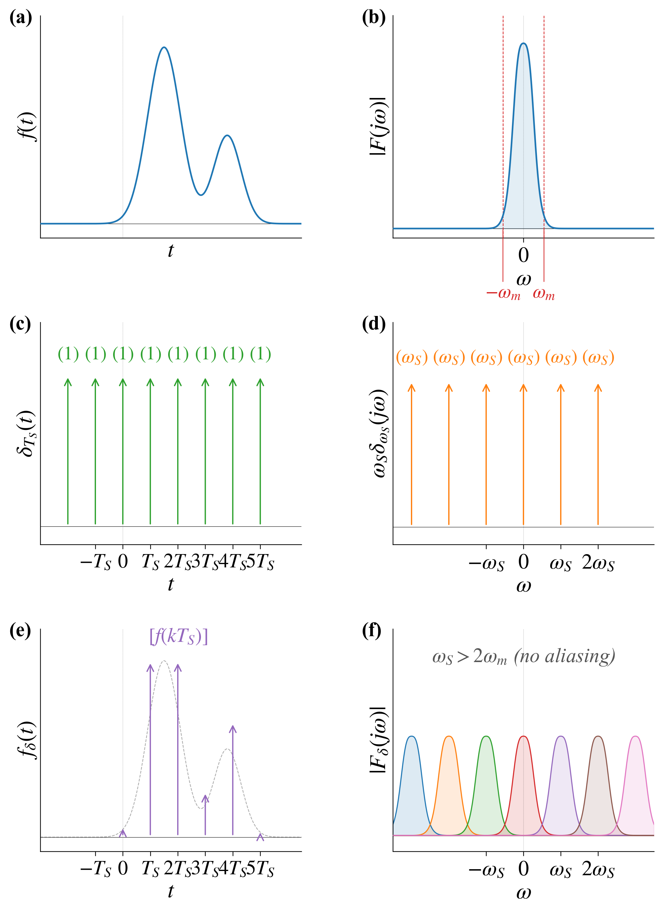

# 笔记

## 取样信号与取样定理

### 离散时间信号——序列

离散时间信号可以通过对连续时间信号进行取样得到，通常采用均匀时间间隔。若时间间隔为$T$，离散时间信号可以用$x(nT)$，或$x(n)$来表示，$n$为整数。

### 典型序列

单位函数序列
$$
\delta(k)=\begin{cases}1, &k=0 \\ 0, &k\neq 0\end{cases}
$$

$$
\delta(k-n)=\begin{cases}1, &k=n \\ 0, &k\neq n\end{cases}
$$

单位阶跃序列
$$
\varepsilon(k)=
\begin{cases}
1 & k \geq 0 \\
0 & k<0
\end{cases}
$$

$$
\varepsilon(k-n)=
\begin{cases}
1 & k \geq n \\
0 & k<n
\end{cases}
$$

单边指数序列
$$
e^{-k} \varepsilon(k)
$$

单边余弦序列
$$
\cos (\beta k) \varepsilon(k)
$$

## 取样信号

取样信号利用取样器（开关）实现。取样信号可看作原函数$f(t)$与开关函数$s(t)$的乘积。

$$
f_{S}(t)=f(t) s(t)
$$

对应频域关系为：
$$
f_S(t) \leftrightarrow \frac{1}{2\pi} F(j\omega) * S(j\omega)
$$
其中开关函数$s(t)$ 的取样间隔为$T_{S}$，$f_{S}=1 / T_{S}$称为取样频率。

### 理想取样信号

理想开关函数为周期冲激序列，对应的理想取样信号也称为冲激取样信号。

傅里叶变换对：
$$
f(t) \leftrightarrow F(j\omega),\quad \delta_{T_{S}}(t) \leftrightarrow \omega_{S} \delta_{\omega_{S}}(\omega)
$$

理想取样信号的时域表达式：
$$
f_{\delta}(t)=f(t) \delta_{T_{S}}(t) \leftrightarrow \frac{1}{2\pi} F(j\omega) * \omega_S \delta_{\omega_S}(\omega)
= \frac{1}{T_S} F(j\omega) * \delta_{\omega_S}(\omega)
$$

取样角频率定义：
$$
\omega_{S}=\frac{2 \pi}{T_{S}}
$$

### 理想取样信号的频谱特性

理想取样信号的频谱是原函数频谱的周期延拓，周期为$\omega_{S}=2 \pi / T_{S}$，具体特性如下：
- 各周期内的频谱形状与原信号频谱$F(j\omega)$ 相同
- 频谱幅度整体乘上因子$1 / T_{S}$
- 相邻周期频谱的间隔为$\omega_{S}$

理想取样信号的频谱展开式：
$$
F_\delta(j\omega) = \frac{1}{T_S} \sum_{k=-\infty}^{\infty} F\left( j\left(\omega - k\omega_S\right) \right)
$$

## 信号的重建

理想取样信号的频谱中，包含频率平移量为零的基带分量，其与原信号频谱形状相同，幅度为$\dfrac{1}{T_S}$。

将理想取样信号通过截止频率为$\dfrac{\omega_{S}}{2}$、通带内幅度为$T_S$、相位为零的理想低通滤波器，即可重建原信号。

### 信号重建的必要条件
要实现无混叠的信号重建，取样信号的频谱中两相邻周期的部分不能重叠，需满足以下条件：
1. 原信号 $F(j\omega)$ 为频带有限信号，即$|\omega| \leq \omega_{m}$
2. 取样角频率大于或等于信号最高角频率的2倍：
$$
\omega_{S} \geq 2 \omega_{m}
$$

当理想低通滤波器的截止频率满足
$$
\omega_{m} \leq \omega_{c} \leq \omega_{s}-\omega_{m}
$$
时，理想低通的输出端可以恢复出原信号。

相关定义：
- Shannon取样频率（Nyquist取样频率）：$2 \omega_{m}$ 或 $2 f_{m}$
- Shannon取样间隔（Nyquist取样间隔）：$1 / 2 f_{m}$ 或 $\pi / \omega_{m}$

### Shannon取样定理
一个在频谱中不包含大于频率$f_{m}$ 的分量的有限频带信号，由对该信号以不大于$1/(2f_m)$ 的时间间隔进行取样的取样值唯一确定。当这样的信号通过截止频率满足$\omega_{m} \leq \omega_{c} \leq \omega_{S}-\omega_{m}$ 的理想低通滤波器后，可以将原信号完全重建。

$$
\omega_{s} \geq 2 \omega_{m}
$$
$$
T_{s} \leq \frac{1}{2 f_{m}}
$$
$$
f_{m}=\frac{\omega_{m}}{2 \pi}
$$
$$
\omega_{s}=\frac{2 \pi}{T_{s}}
$$

## LTI离散时间系统的描述和模拟

### LTI离散时间系统

- 线性特性
  $$
  C_1e_1(k)+C_2e_2(k) \rightarrow \boxed{\text{系统}} \rightarrow C_1r_1(k)+C_2r_2(k)
  $$

- 移不变特性
  $$
  e(k-N) \rightarrow \boxed{\text{系统}} \rightarrow r(k-N)
  $$

- 线性移不变特性
  $$
  C_1e_1(k-M)+C_2e_2(k-N) \rightarrow \boxed{\text{系统}} \rightarrow C_1r_1(k-M)+C_2r_2(k-N)
  $$
  

### 差分运算

$f(t)$的取样信号$f(kT)$，简写为$f(k)$。

微分运算
$$
\frac{\mathrm{d}f(t)}{\mathrm{d} t}=\lim_{T \to 0}\frac{f(kT+T)-f(kT)}{T}
$$
差分运算

- 一阶前向差分
  $$
  \frac{\Delta f(K)}{\Delta k}=\frac{f(k+1)-f(k)}{(k+1)-k}
  $$

- 一阶后向差分
  $$
  \frac{\nabla f(K)}{\nabla k}=\frac{f(k)-f(k-1)}{k-(k-1)}
  $$
  

$f(k+1)$和$f(k-1)$称为$f(k)$的移位序列。

### 输入输出方程一般形式：n阶常系数差分方程

$$
r(k+n)+a_{n-1}r(k+n-1)+\dots+a_1 r(k+1)+a_0 r(k)
= b_m e(k+m)+b_{m-1} e(k+m-1)+\dots+b_1 e(k+1)+b_0 e(k)
$$

差分方程包含离散变量及其增序或减序函数，描述离散序列中相邻几个数据点之间的数学关系。

差分方程的阶数等于自变量最高和最低移序量之差。

对比LTI连续时间系统的数学模型 —— n阶微分方程：

$$
r^{(n)} + a_{n-1} r^{(n-1)} + \dots + a_1 r' + a_0 r
= b_m e^{(m)} + b_{m-1} e^{(m-1)} + \dots + b_1 e' + b_0 e
$$

离散与连续系统的对应关系：
$$
r^{(n)} \to r(k+n)
$$

### 移序算子

移序算子$S$
$$
S[r(k)]=r(k+1)
$$

n阶差分方程的算子表示：
$$
\left(S^{n}+a_{n-1} S^{n-1}+\dots+a_{1} S+a_{0}\right) r(k)
$$

对比LTI连续时间系统的算子方程：
$$
\left(p^{n}+a_{n-1} p^{n-1}+\dots+a_{1} p+a_{0}\right) r(t)
$$

$$
H(p)=\frac{N(p)}{D(p)}
$$

### 差分方程数值解法

差分方程本质上是递推的代数方程，若已知初始条件和激励，利用迭代法可求得其数值解。

一阶常系数差分方程：
$$
r(k+1)+2 r(k)=e(k),\quad r(0)=1,\quad e(k)=2^{k} \varepsilon(k)
$$

这是前向差分方程，已知 $r(k)$、$e(k)$，可推出 $r(k+1)$ 及 $r(k+2)$、$r(k+3)$……

$$
\begin{aligned}
r(1)&=e(0)-2 r(0)=-1 \\
r(2)&=e(1)-2 r(1)=4 \\
r(3)&=e(2)-2 r(2)=-4
\end{aligned}
$$

一般无法得到解析解。

### LTI离散时间系统模拟框图

## LTI离散时间系统的零输入响应

### 零输入响应

零输入响应即激励 $e(k)=0$ 时，齐次差分方程的解。

n阶齐次差分方程的一般形式：
$$
r(k+n)+a_{n-1} r(k+n-1)+\dots+a_{1} r(k+1)+a_{0} r(k)=0
$$

用移位算子 $S$ 可表示为：
$$
\left[S^{n}+a_{n-1} S^{n-1}+\dots+a_{1} S+a_{0}\right] r(k)=0
$$

令特征多项式 $D(S)=0$，n阶系统对应 $n$ 个初始条件 $r(0),r(1),\dots,r(n-1)$。求解特征方程得到特征根 $\gamma_1,\gamma_2,\dots$ 后，按根的类型构造解的形式：
- 单根 $\gamma_i$ 对应的解分量：$r_i(k)=C_i \gamma_i^{k}$
- $p$ 重根 $\gamma_i$ 对应的解分量：$r_i(k)=\left(b_{1}+b_{2} k+\dots+b_{p} k^{p-1}\right) \gamma_{i}^{k}$

与连续系统对比：连续系统中单根对应解为 $r_i(t)=C_i e^{\lambda_i t}$，$p$ 重根对应解为 
$$
r_i(t)=\left(b_{1}+b_{2} t+\dots+b_{p} t^{p-1}\right) e^{\lambda_i t}
$$

### 一阶系统零输入响应

一阶系统零输入响应可通过迭代法推导，一阶齐次差分方程为：
$$
r(k+1)+a_{0} r(k)=0
$$

特征多项式 $D(S)=S+a_{0}$，特征根 $\gamma=-a_0$。

迭代过程如下：
$$
r(1)=-a_{0} r(0)
$$
$$
r(2)=-a_{0} r(1)=\left(-a_{0}\right)^{2} r(0)
$$
$$
r(3)=-a_{0} r(2)=\left(-a_{0}\right)^{3} r(0)
$$
……

归纳得到通解形式：
$$
r(k)=C \gamma^{k}
$$

代入初始条件 $k=0$，得 $C=r(0)$，因此一阶系统零输入响应为：
$$
r(k)=\left(-a_{0}\right)^{k} r(0)
$$

## 单位函数响应

系统对单位样值序列$\delta(k)$的零状态响应，称单位函数响应，表示为$h(k)$。

令$e(k)=\delta(k)$，求解差分方程
$$
\left(S^{n}+a_{n-1} S^{n-1}+\dots+a_{1} S+a_{0}\right) h(k)=\left(b_mS^{m}+b_{m-1} S^{m-1}+\dots+b_{1}S+b_{0}\right) \delta(k)
$$

从转移算子求解，利用部分分式法及下表
$$
H(S)=\frac{N(S)}{D(S)}=\sum H_{i}(S) \Rightarrow h(k)=\sum h_{i}(k)
$$

转移算子对应的单位函数响应见表：

| 转移算子 $H(S)$ | 单位函数响应 $h(k)$ |
| :--- | :--- |
| 1 | $\delta(k)$ |
| $\dfrac{1}{S-\gamma}$ | $\gamma^{k-1} \varepsilon(k-1)$ |
| $\dfrac{S}{S-\gamma}$ | $\gamma^k \varepsilon(k)$ |
| $\dfrac{S}{(S-\gamma)^2}$ | $k\gamma^k \varepsilon(k)$ |
| $\dfrac{S}{(S-\gamma)^p}$ | $\dfrac{k(k-1)\cdots(k-p+2)}{(p-1)!}\gamma^{k-p+1}\varepsilon(k)$ |

### n阶系统单位函数响应一般形式
系统转移算子通式：
$$
H(S)=\frac{b_{m} S^{m}+b_{m-1} S^{m-1}+\dots+b_{1} S+b_{0}}{S^{n}+a_{n-1} S^{n-1}+\dots+a_{1} S+a_{0}}
$$

按分子分母阶次分情况：

1. $m<n,\ b_{0}=0$
$$H(S)=\sum \frac{A_{i}}{S-\gamma_{i}}$$
$$h(k)=\sum A_{i} \gamma_{i}^{k-1} \varepsilon(k-1)$$

2. $m=n,\ b_{0} \neq 0$
- 形式一：
  $$H(S)=S\left[\sum \frac{A_{i}}{S-\gamma_{i}}\right]$$
  $$h(k)=\sum A_{i} \gamma_{i}^{k} \varepsilon(k)$$
- 形式二：
  $$H(S)=1+\sum \frac{A_{i}}{S-\gamma_{i}}$$
  $$h(k)=\delta(k)+\sum A_{i} \gamma_{i}^{k-1} \varepsilon(k-1)$$

3. $m<n,\ b_{0} \neq 0$
$$H(S)=\sum \frac{A_{i}}{S-\gamma_{i}}$$
$$h(k)=\sum A_{i} \gamma_{i}^{k-1} \varepsilon(k-1)$$

## 卷积和

## LTI离散时间系统的零状态响应

# 作业

## 例题1

> 已知一阶线性微分方程
> $$
> \frac{\mathrm{d}}{\mathrm{d}t} r(t) + a r(t) = b e(t)
> $$
> 取离散时刻$t = kT$（$k$为整数，$T$为采样步长），当$T \to 0$时，用向前差商
> $$
> \frac{\mathrm{d}}{\mathrm{d}t} r(t) \approx \frac{r(kT + T) - r(kT)}{T}
> $$
> 近似替代导数项，将该微分方程转化为近似的差分方程。
> 

记离散序列$r(k) = r(kT)$，$e(k) = e(kT)$，将向前差商代入原微分方程，得到：
$$
\frac{r(k+1) - r(k)}{T} + a r(k) = b e(k)
$$

等式两边同乘$T$并整理项：
$$
r(k+1) - r(k) + aT \cdot r(k) = bT \cdot e(k)
$$

合并同类项后，得到标准一阶线性差分方程：
$$
r(k+1) + (aT - 1) r(k) = bT e(k)
$$

## 零输入响应练习1

> 已知差分方程 $r(k+2)+4r(k+1)+4r(k)=0$，初始条件 $r(0)=2$，$r(1)=2$，求零输入响应。

特征方程：

$$
D(S)=S^{2}+4S+4=(S+2)^{2}=0
$$

特征根 $\gamma_{1,2}=-2$

零输入响应形式：

$$
y_{zi}(k)=\left(C_{1}+C_{2}k\right)(-2)^{k}\varepsilon(k)
$$

代入初始条件求解系数：

$$
\begin{cases}
r(0)=C_{1}=2 \\
r(1)=\left(C_{1}+C_{2}\right)(-2)=2
\end{cases}
\Rightarrow
\begin{cases}
C_{1}=2 \\
C_{2}=-3
\end{cases}
$$

最终零输入响应：

$$
y_{zi}(k)=(2-3k)(-2)^{k}\varepsilon(k)
$$

## 零输入响应练习2

> 已知差分方程 $r(k+3)+6r(k+2)+12r(k+1)+8r(k)=0$，初始条件 $r(0)=1$，$r(1)=1$，$r(2)=0$，求零输入响应。

特征方程：

$$
D(S)=S^{3}+6S^{2}+12S+8=(S+2)^{3}=0
$$

特征根 $\gamma_{1,2,3}=-2$

零输入响应形式：

$$
y_{zi}(k)=\left(C_{1}+C_{2}k+C_{3}k^{2}\right)(-2)^{k}\varepsilon(k)
$$

代入初始条件：

$$
r(0)=C_{1}=1
$$

$$
r(1)=\left(C_{1}+C_{2}+C_{3}\right)(-2)=1
$$

$$
r(2)=\left(C_{1}+2C_{2}+4C_{3}\right)(-2)^{2}=0
$$

## 零输入响应练习3

> 已知差分方程 $r(k+4)-2r(k+3)+2r(k+2)-2r(k+1)+r(k)=0$，初始条件 $r(1)=1$，$r(2)=0$，$r(3)=1$，$r(5)=1$，求零输入响应。

特征方程：

$$
D(S)=S^{4}-2S^{3}+2S^{2}-2S+1=(S-1)^{2}\left(S^{2}+1\right)=0
$$

特征根 $\gamma_{1,2}=1$，$\gamma_{3,4}=\pm j$

零输入响应复指数形式：

$$
y_{zi}(k)=\left(C_{1}+C_{2}k\right)1^{k}+C_{3}j^{k}+C_{4}(-j)^{k}
$$

或实函数形式：

$$
y_{zi}(k)=\left(C_{1}+C_{2}k\right)1^{k}+C_{3}\cos\frac{k\pi}{2}+C_{4}\sin\frac{k\pi}{2}
$$

最终零输入响应：

$$
y_{zi}(k)=1+\cos\frac{k\pi}{2}
$$

## 单位函数响应练习1
> 一阶系统，差分方程：$h(k+1)-\gamma h(k)=\delta(k)$

转移算子：
$$
H(S)=\frac{1}{S-\gamma}
$$

初始值递推计算：
$$
\begin{aligned}
h(0)&=\delta(-1)+\gamma h(-1)=0 \\
h(1)&=\delta(0)+\gamma h(0)=1=\gamma^{0} \\
h(2)&=\delta(1)+\gamma h(1)=\gamma h(1)=\gamma \\
\end{aligned}
$$

通用递推推导：
$$
\begin{aligned}
h(k) & =\delta(k-1)+\gamma h(k-1) \\
& =\gamma h(k-1) \\
& =\gamma\left[\gamma h(k-2)\right] \\
& =\gamma^{k-1} h(1)
\end{aligned}
$$

最终单位函数响应：
$$
h(k)=\gamma^{k-1} \varepsilon(k-1)
$$

其中单位序列定义：
$$\delta(k)=
\begin{cases}
1 & k=0 \\
0 & k \neq 0
\end{cases}$$

## 单位函数响应练习2

> 差分方程：$r(k+1)-\gamma r(k)=e(k+1)$

转移算子拆分：
$$
H(S)=\frac{r(k)}{e(k)}=\frac{S}{S-\gamma}=1+\frac{\gamma}{S-\gamma}
$$

单位函数响应推导：
$$
\begin{aligned}
h(k) & =\delta(k)+\gamma \cdot \gamma^{k-1} \varepsilon(k-1) \\
& =\delta(k)+\gamma^{k}\left[\varepsilon(k)-\delta(k)\right]=\gamma^{k} \varepsilon(k)
\end{aligned}
$$

结论：当系统转移算子满足 $m=n$ 且比值常数为1时，输出响应中包含一个输入激励的直通分量。

## 单位函数响应练习3
> 已知差分方程 $r(k+2)+2 r(k+1)-3 r(k)=e(k+1)+2 e(k)$，求单位函数响应

对转移算子做部分分式展开：
$$
H(S)=\frac{S+2}{S^{2}+2 S-3}=\frac{3 / 4}{S-1}+\frac{1 / 4}{S+3}
$$

单位函数响应：
$$
h(k)=\frac{3}{4} \cdot 1^{k-1} \varepsilon(k-1)+\frac{1}{4}(-3)^{k-1} \varepsilon(k-1)
$$

## 单位函数响应练习4
> 已知差分方程 $r(k+2)-2 \gamma r(k+1)+\gamma^{2} r(k)=e(k)$，求单位函数响应

对转移算子做变形拆分：
$$
H(S)=\frac{1}{(S-\gamma)^{2}}=\left[\frac{S}{(S-\gamma)^{2}}-\frac{1}{S-\gamma}\right] \frac{1}{\gamma}
$$

单位函数响应推导：
$$
\begin{aligned}
h(k) & =\left[k \gamma^{k-1} \varepsilon(k)-\gamma^{k-1} \varepsilon(k-1)\right] \gamma^{-1} \\
& =(k-1) \gamma^{k-2} \varepsilon(k-1)
\end{aligned}
$$